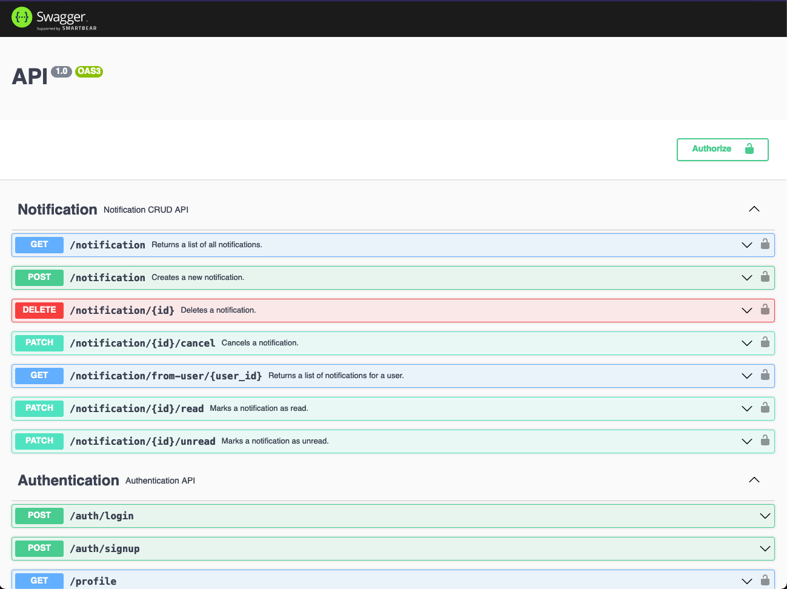
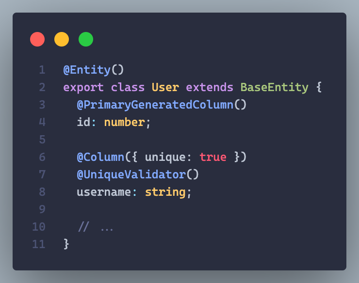
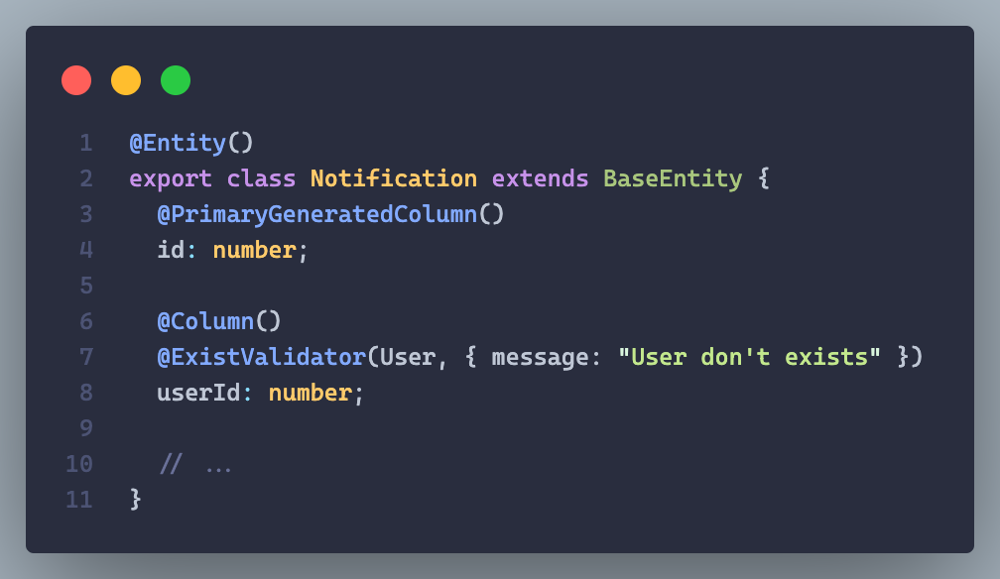
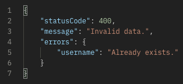
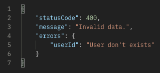
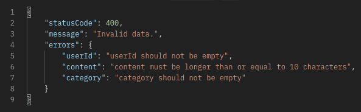
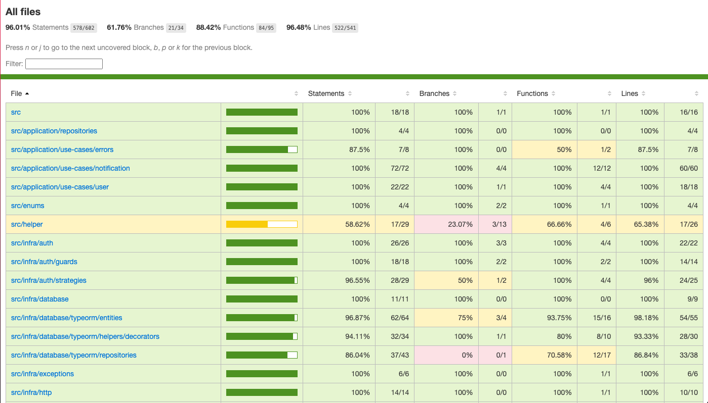

<p align="center">
  <a href="http://nestjs.com/" target="blank"></a>
</p>

[circleci-image]: https://img.shields.io/circleci/build/github/nestjs/nest/master?token=abc123def456
[circleci-url]: https://circleci.com/gh/nestjs/nest

<p align="center">A progressive <a href="http://nodejs.org" target="_blank">Node.js</a> framework for building efficient and scalable server-side applications.</p>

## Description

[Nest](https://github.com/nestjs/nest) framework TypeScript starter repository.

## Built with

- 
- 
  - JWT
  - Swagger
  - Class validator
  - Custom validators for database constraints
  - TypeORM
- 
- 
- 
- 
- 

## Prints 📷

<details>
  <summary>Swagger</summary>

  URL: **/api**

  
</details>

<details>
  <summary>Friendly errors on response</summary>

  - Custom validators
    - **Unique** constraint
    - **Exist** constraint

  
  

  - All errors are returned inside **"errors"** key on response.
  - Validate model data before saving to database to get all database errors (via custom validators)

  
  
  
</details>

<details>
  <summary>Test coverage</summary>

  ## e2e coverage (96%!)

  
</details>

## Installation

```bash
$ npm install
$ cp .env.example .env
```

## Running the app

```bash
# development
$ npm run start

# watch mode
$ npm run start:dev

# production mode
$ npm run start:prod
```

## Test

```bash
# unit tests
$ npm run test

# e2e tests
$ npm run test:e2e

# test coverage
$ npm run test:cov
```

## Roadmap

- [x] TypeORM
- [ ] Migrations
- [x] CRUD User
- [x] CRUD Notification
- [ ] JWT
  - [x] Access Token
  - [ ] Refresh Token
- [x] Pagination
- [ ] Unit tests
  - [x] Use cases
  - [ ] Controllers
  - [ ] Coverage 100% (30%)
- [x] e2e tests
  - [x] Coverage 100% (96% is almost 100% 👌)
- [x] Database constraints
- [ ] Fix docker
  - [ ] Update README.md with docker steps
- [ ] Run tests on Pull Requests
- [ ] PR template

## Support

Nest is an MIT-licensed open source project. It can grow thanks to the sponsors and support by the amazing backers. If you'd like to join them, please [read more here](https://docs.nestjs.com/support).

## Stay in touch

- Author - [Kamil Myśliwiec](https://kamilmysliwiec.com)
- Website - [https://nestjs.com](https://nestjs.com/)
- Twitter - [@nestframework](https://twitter.com/nestframework)

## License

Nest is [MIT licensed](LICENSE).
